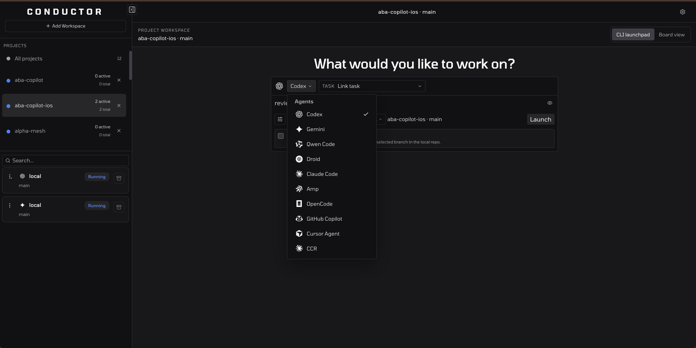
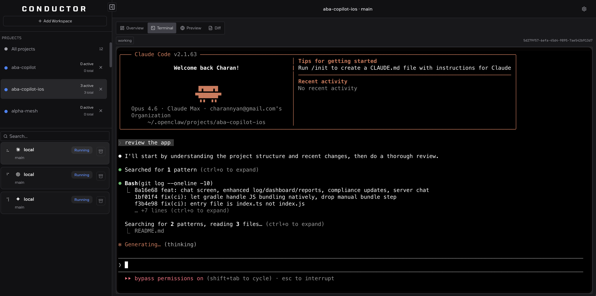
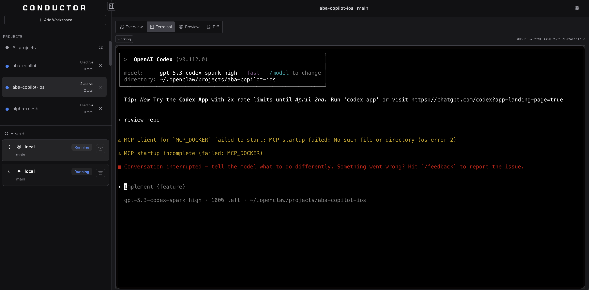
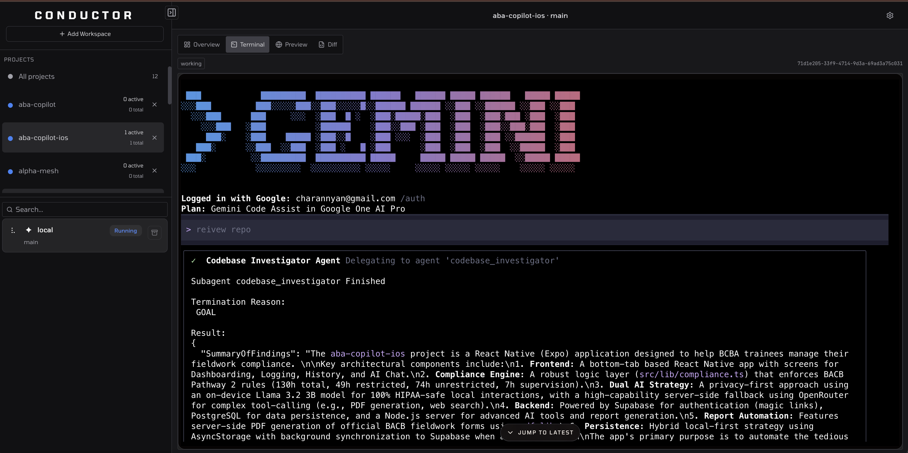
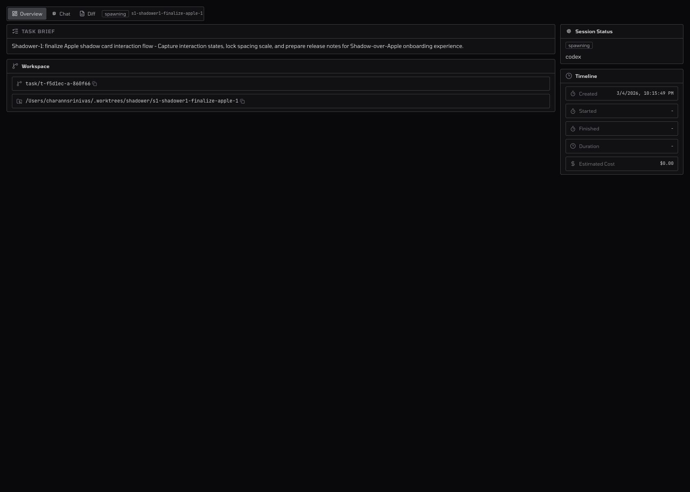

<div align="center">

# Conductor OSS

### The local-first control plane for AI coding agents

**One command. Markdown-native. Real terminals.**

[](https://www.npmjs.com/package/conductor-oss)
[](https://github.com/charannyk06/conductor-oss/actions/workflows/ci.yml)
[](LICENSE)
[](https://www.rust-lang.org)
[](https://github.com/charannyk06/conductor-oss/stargazers)

</div>

---

Conductor OSS is a local-first orchestration layer for AI coding agents. It turns Markdown kanban boards into dispatchable work, launches installed coding CLIs in isolated git worktrees, and gives you a browser dashboard for live terminal sessions, diffs, previews, and recovery workflows.

By default, everything runs on your machine. Conductor keeps board state in Markdown, stores runtime metadata in SQLite, and leaves authentication and billing to the upstream agent CLIs.

## Why Conductor

Running one agent in one terminal works for one task. Conductor is for the next step: multiple tasks, multiple repos, multiple agents, shared queues, session recovery, live review, and one dashboard to coordinate all of it.

Conductor adds:

- **Markdown-native planning** with `CONDUCTOR.md` boards that stay readable in Obsidian or any editor
- **Dispatch orchestration** that turns tagged cards into queued agent work
- **Worktree isolation** so concurrent sessions do not trample the same branch
- **Native terminal sessions** over ttyd-backed PTYs instead of synthetic chat shells
- **Operational visibility** through session feeds, diffs, previews, health views, and cleanup tools
- **Recovery loops** with retry, restore, reviewer feedback, and session health tracking

## Quick Start

### Requirements

- Node.js `>= 18`
- `git`
- At least one supported coding agent CLI installed and authenticated

### Launch

```bash
npx conductor-oss@latest
```

Running the package with no arguments defaults to `start --open`.

- Primary launcher URL: `http://127.0.0.1:4747`
- Launcher-managed Rust backend: `http://127.0.0.1:4748` by default
- The native Rust `conductor start` binary uses `4747` unless you override `--port`

### Initialize an existing repo

```bash
npx conductor-oss@latest init
npx conductor-oss@latest start --workspace .
```

`init` scaffolds `conductor.yaml` and `CONDUCTOR.md`. The SQLite database at `.conductor/conductor.db` is created the first time the backend starts.

### Global install

```bash
npm install -g conductor-oss
co start
```

The launcher registers three aliases: `conductor-oss`, `conductor`, and `co`.

## Supported Agents

Conductor ships adapters for the major coding CLIs it knows how to discover, launch, and monitor today.

| Agent | CLI |
|-------|-----|
| Claude Code | `claude` |
| Codex | `codex` |
| Gemini | `gemini` |
| Qwen Code | `qwen` |
| Amp | `amp` |
| Cursor Agent | `cursor-agent` |
| OpenCode | `opencode` |
| Droid | `droid` |
| GitHub Copilot | `gh copilot` / `copilot` |
| CCR | `ccr` |

## Native Terminal Experience

Conductor launches agents into their real terminal UIs. Claude Code runs as Claude Code. Codex runs as Codex. Interactive sessions are ttyd-backed PTYs, so reconnects, resize events, and terminal restore behave like a real terminal session rather than a browser chat imitation.

<div align="center">

| Agent Picker | Claude Code Session |
|:---:|:---:|
|  |  |

| Codex Session | Gemini Session |
|:---:|:---:|
|  |  |

</div>

## How It Works

### Task Lifecycle

```text
Inbox -> Ready to Dispatch -> Dispatching -> In Progress -> Review -> Done
```

1. Create tasks in `CONDUCTOR.md`.
2. Move work into `Ready to Dispatch`.
3. Conductor selects an agent, prepares the workspace, and launches a session.
4. The agent runs in an isolated git worktree with a compiled task prompt and any context attachments.
5. You monitor progress from the dashboard and the live terminal.
6. You review diffs, preview local apps, send feedback, retry, restore, or clean up.

### Dashboard Surfaces

Each session page includes:

- **Terminal** for the live interactive PTY session
- **Overview** for normalized session state, metadata, and recovery actions
- **Preview** for project dev-server URLs
- **Diff** for file changes and workspace inspection

<div align="center">

| Dashboard Overview | Session Detail |
|:---:|:---:|
|  |  |

</div>

## CLI Reference

The npm launcher (`co`) is the primary user-facing CLI.

| Command | Description |
|---------|-------------|
| `co start` | Start the dashboard and Rust backend |
| `co init` | Scaffold `conductor.yaml` and `CONDUCTOR.md` |
| `co setup` | Guided first-run setup for agents, editors, and local tooling |
| `co spawn` | Create a new session |
| `co list` | List sessions |
| `co status` | Show the current attention-oriented status board |
| `co send` | Send a message to a running session |
| `co feedback` | Send reviewer feedback and requeue a session |
| `co retry` | Create a new attempt from an existing task or session |
| `co restore` | Restore an exited session |
| `co kill` | Terminate a session |
| `co cleanup` | Reclaim resources from completed sessions |
| `co doctor` | Inspect backend and session health |
| `co dashboard` | Open the dashboard in a browser |
| `co task show <taskId>` | Inspect task attempts, parent, and child tasks |
| `co mcp-server` | Run Conductor as an MCP server over stdio |

A lower-level Rust CLI also exists for development and internal flows. That native binary is where the current `bridge` subcommands live.

## Remote Access and Bridge

Conductor is local-first, but the current codebase includes several remote and access-control paths:

- **Private remote access** via a Tailscale link managed from the dashboard
- **Verified edge auth** via Cloudflare Access JWT validation and role bindings
- **Optional Clerk integration** for hosted sign-in flows in the web app
- **Bridge and relay components** for paired-device flows and relay-backed terminals

What is no longer supported:

- Public share-link remote control without an identity layer
- The old tmux-first terminal model

The user-facing paired-device flow is built around the companion `conductor-bridge` binary and the dashboard bridge pages. The repo also contains `bridge-cmd/`, `crates/conductor-relay/`, and native Rust `conductor bridge ...` commands for lower-level bridge and relay development.

## Local Files and Runtime Artifacts

Conductor uses a small set of local files:

| File | Purpose |
|------|---------|
| `conductor.yaml` | Workspace config, project definitions, access rules, and preferences |
| `CONDUCTOR.md` | Markdown kanban board for planning and dispatch |
| `.conductor/conductor.db` | SQLite state for sessions, attempts, metadata, and runtime coordination |

Common runtime artifacts:

- `.conductor/rust-backend/detached/` for restore data and detached PTY runtime state
- `attachments/` for uploaded files and generated session artifacts
- `~/.conductor/` for launcher runtime state and optional bridge token/state files

## Develop From Source

### Prerequisites

- Rust stable toolchain
- Bun `>= 1.2`
- Node.js `>= 18`
- `git`

### Setup

```bash
bun install
```

### Commands

```bash
bun run dev:full     # Dashboard on 3000 + Rust backend on 4749
bun run dev          # Dashboard only
bun run dev:backend  # Backend only through the launcher path
bun run build        # Production build
bun run typecheck    # TypeScript type checking

export CONDUCTOR_DEV_DASHBOARD_PORT=3000  # optional
export CONDUCTOR_DEV_BACKEND_PORT=4749    # optional

cargo test --workspace
cargo clippy --workspace -- -D warnings
```

### Port Reference

| Scenario | Dashboard | Rust backend |
|----------|-----------|--------------|
| `co start` launcher defaults | `4747` | `4748` |
| Source dev scripts in this repo | `3000` | `4749` |
| Native `cargo run --bin conductor -- start` | n/a | `4747` |

## Project Structure

```text
conductor-oss/
├── bridge-cmd/               # Companion bridge binary used by the pairing flow
├── crates/
│   ├── conductor-cli/        # Native Rust CLI
│   ├── conductor-core/       # Config, board parsing, task/session models, scaffolding
│   ├── conductor-db/         # SQLite persistence
│   ├── conductor-executors/  # Agent adapters and process management
│   ├── conductor-git/        # Git and worktree operations
│   ├── conductor-relay/      # Relay server for bridge and remote terminal flows
│   ├── conductor-server/     # Axum server, routes, runtime state, SSE
│   ├── conductor-types/      # Shared transport and bridge protocol types
│   ├── conductor-watcher/    # Filesystem watching
│   └── notify-rust/          # Desktop notification support
├── packages/
│   ├── cli/                  # npm launcher
│   ├── core/                 # Shared TypeScript types and schemas
│   └── web/                  # Next.js dashboard
├── docs/
│   ├── demo/                 # Workflow demos
│   ├── screenshots/          # Dashboard and terminal screenshots
│   └── terminal-*.md         # Terminal protocol and QA docs
├── Cargo.toml                # Rust workspace
├── package.json              # Bun workspace
├── conductor.yaml            # Workspace config (user-created)
└── CONDUCTOR.md              # Board file (user-created)
```

## Known Constraints

- Output quality depends on the upstream agent CLI you install; Conductor orchestrates it, not its model behavior
- GitHub-heavy flows work best with `gh` installed and authenticated
- Preview tooling depends on a project exposing a local dev server or explicit preview URL
- Public remote admin links were removed; use Tailscale or a verified identity layer instead
- Legacy tmux and legacy direct sessions are compatibility data that should be archived rather than resumed

## Links

- GitHub: <https://github.com/charannyk06/conductor-oss>
- npm: <https://www.npmjs.com/package/conductor-oss>
- Issues: <https://github.com/charannyk06/conductor-oss/issues>
- Pull requests: <https://github.com/charannyk06/conductor-oss/pulls>

## Star History

[](https://star-history.com/#charannyk06/conductor-oss&Date)

## License

MIT. See [LICENSE](LICENSE).
