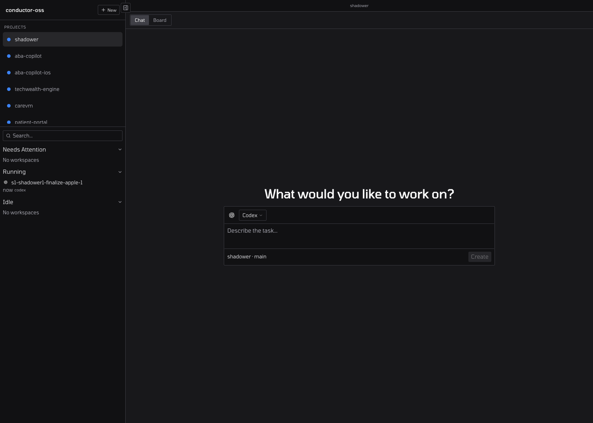
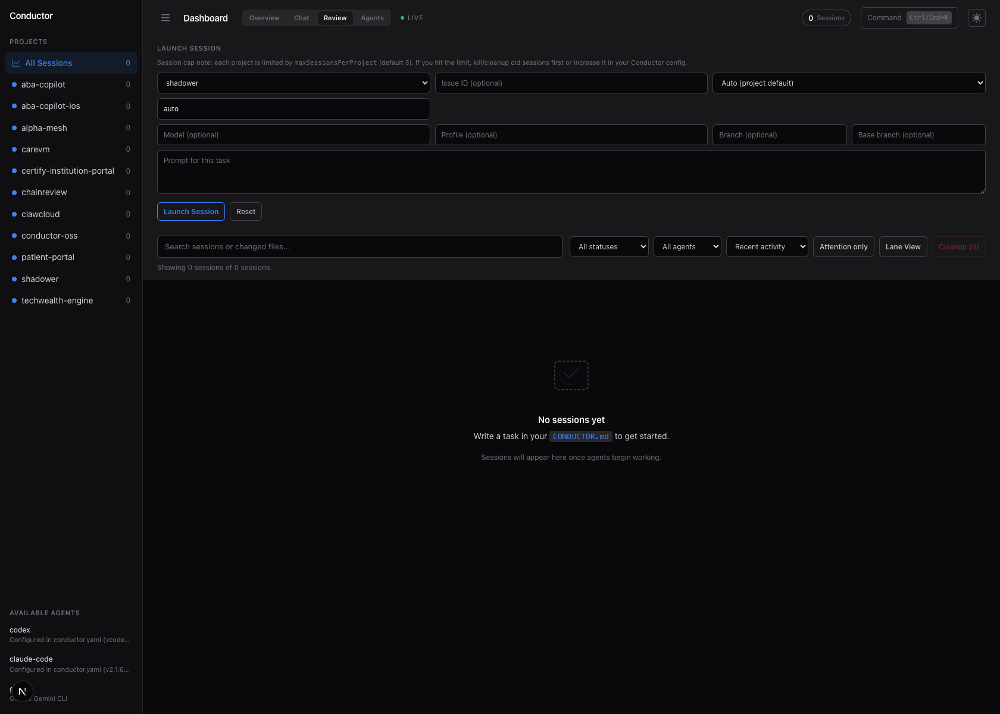
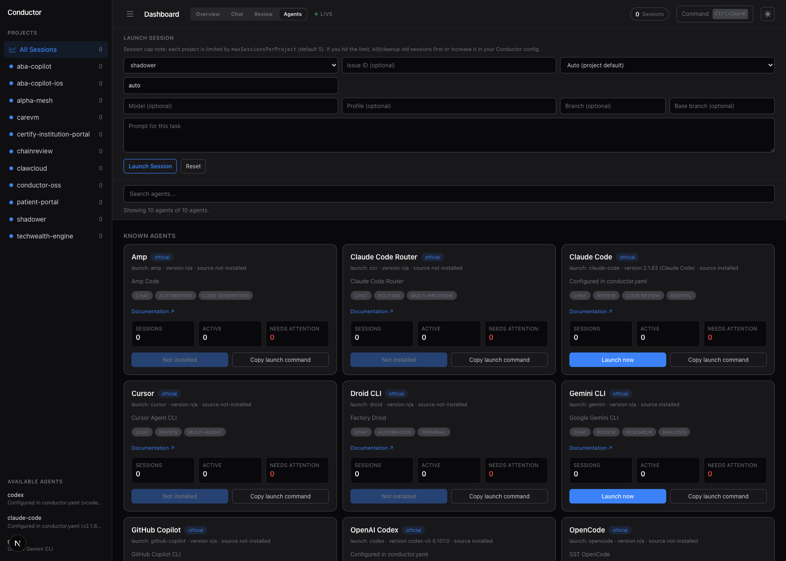
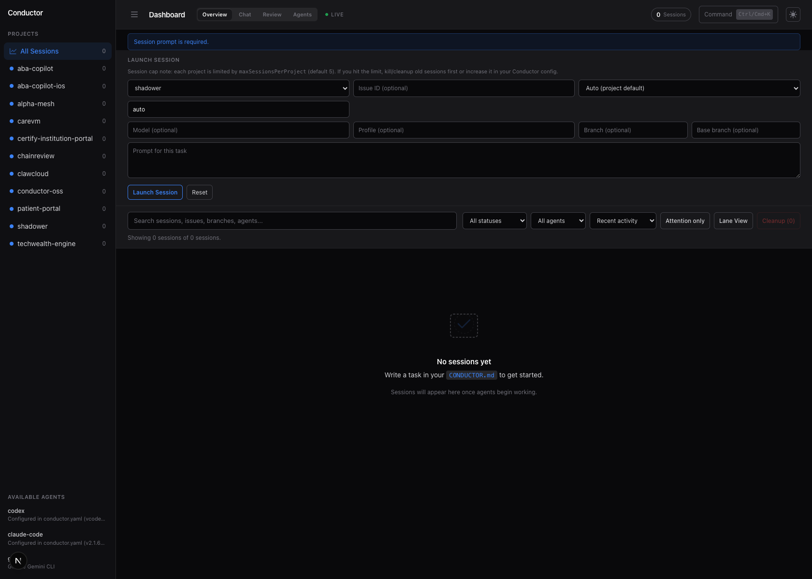
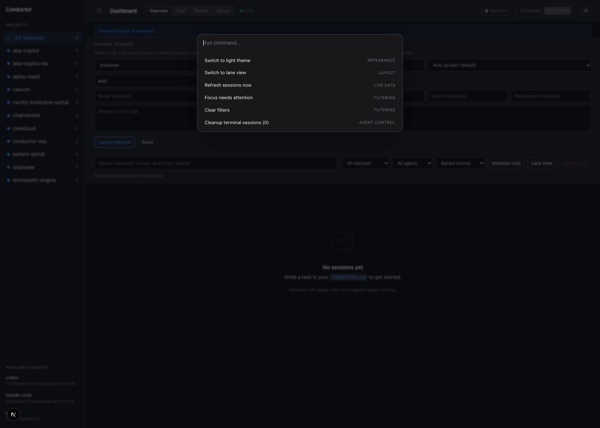
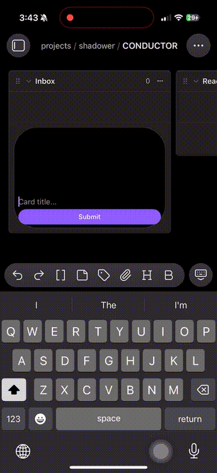
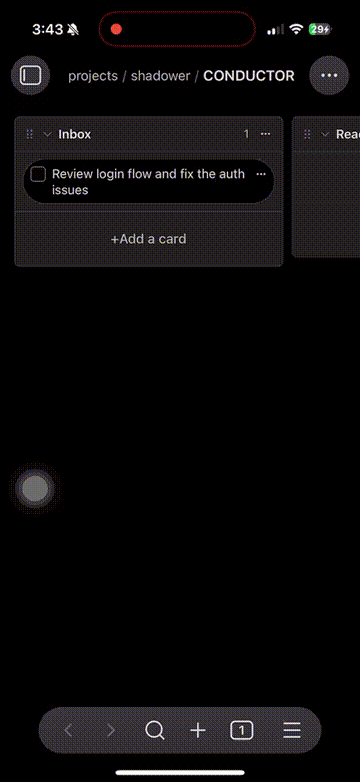
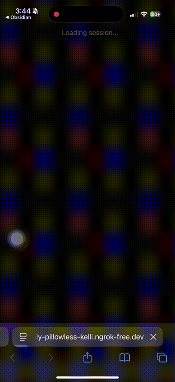
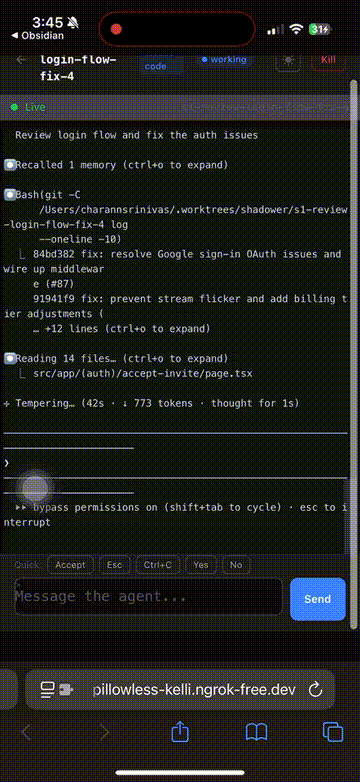
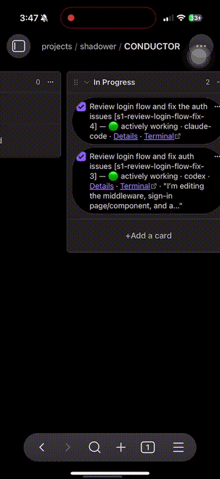

<div align="center">

<!-- Logo placeholder — drop a conductor.svg in docs/ -->
<!--  -->

# Conductor OSS

**Markdown-native AI agent orchestrator.**
Write tasks in a kanban board — Conductor dispatches agents, manages git worktrees, tracks PRs, and updates your board automatically.

<br>

[](https://www.npmjs.com/package/conductor-oss)
[](https://github.com/charannyk06/conductor-oss/actions/workflows/ci.yml)
[](LICENSE)
[](https://nodejs.org)
[](https://pnpm.io)
[](https://github.com/charannyk06/conductor-oss/stargazers)

</div>

## What is Conductor?

Conductor turns your markdown kanban board into a fully autonomous AI development pipeline. Write a task in plain English, tag it with an agent and project, drag it to **Ready to Dispatch** — and Conductor handles everything else: spawning the agent in an isolated git worktree, streaming live output to a web dashboard, opening a pull request, watching CI, and updating your board card with the result.

It runs entirely on your machine. No cloud. No database. No SaaS subscription.

---

## Why Conductor?

| | Manual workflow | Other tools | **Conductor** |
|---|---|---|---|
| Task format | Jira / Linear ticket | Proprietary UI | **Plain markdown** |
| Where tasks live | Cloud app | Cloud app | **Your own files** |
| Agent execution | Manual | Managed cloud | **Local — your machine, your keys** |
| Multiple agents | Clipboard juggling | Vendor lock-in | **Claude Code, Codex, Gemini — pick any** |
| Context isolation | Manual branches | Varies | **Git worktree per task** |
| PR lifecycle | Manual | Partial | **Full: open → CI → review → merge** |
| Database required | — | Often | **Never — flat files only** |
| Cost | Subscription | Subscription | **Free + your API keys** |

---

## Repository Links

- GitHub Repository: https://github.com/charannyk06/conductor-oss
- Issues: https://github.com/charannyk06/conductor-oss/issues
- Pull Requests: https://github.com/charannyk06/conductor-oss/pulls
- CI: https://github.com/charannyk06/conductor-oss/actions/workflows/ci.yml
- NPM Package: https://www.npmjs.com/package/conductor-oss

---

## Demo

<details open>
<summary><strong>Live flow capture</strong> — task → launch → terminal → review/merge controls</summary>

<br>

### 1) Dashboard overview



### 2) Chat queue and manual responses


### 3) Review and PR triage



### 4) Agents health and install state



### 5) Launching a new session



### 6) Command palette + quick actions



</details>

## Demo videos & GIFs

### Legacy demo captures







Full-length captures:

- [Full demo (GIF)](docs/demo/full-demo.gif)
- [Full demo (MP4)](docs/demo/full-demo.mp4)
- [Task + PR flow (MP4)](docs/demo/05-pr-and-board.mp4)
- [Task creation + dispatch (MP4)](docs/demo/01-add-task.mp4)
- [Auto dispatch terminal (MP4)](docs/demo/02-auto-dispatch.mp4)
- [Live terminal (MP4)](docs/demo/03-live-terminal.mp4)
- [Dashboard (MP4)](docs/demo/04-dashboard.mp4)
- [PR creation (MP4)](docs/demo/06-pr-creation.mp4)

### New cropped walkthrough (5:13 recording from March 01, 2026)

- **01) Flow overview + task orchestration**
  - [Flow overview (GIF)](docs/demo/flow-overview.gif) (0:00-0:50)
  - [Flow overview (MP4)](docs/demo/flow-overview.mp4) (0:00-0:50)
- **02) Live terminal execution**
  - [Terminal session (GIF)](docs/demo/session-terminal.gif) (0:50-2:50)
  - [Terminal session (MP4)](docs/demo/session-terminal.mp4) (0:50-2:50)
- **03) Session PR generation + completion**
  - [PR generation (GIF)](docs/demo/session-pr-review.gif) (2:50-4:10)
  - [PR generation (MP4)](docs/demo/session-pr-review.mp4) (2:50-4:10)
- **04) GitHub PR review + merge controls**
  - [GitHub review (GIF)](docs/demo/github-pr-review.gif) (4:10-5:13)
  - [GitHub review (MP4)](docs/demo/github-pr-review.mp4) (4:10-5:13)

Full capture (from the same source recording):

- [Mar 01 full walkthrough (GIF)](docs/demo/full-demo.gif)
- [Mar 01 full walkthrough (MP4)](docs/demo/full-demo.mp4)

---

## Quick Start

```bash
# 1. Install
npm install -g conductor-oss
# or: npx conductor-oss init

# 2. Scaffold a project
mkdir my-project && cd my-project
co init

# 3. Edit conductor.yaml — set your project path + GitHub repo
# (takes 30 seconds)

# 4. Start the orchestrator
co start

# 4b. Optional: run against an explicit workspace/config path
cd /path/to/workspace
CO_CONFIG_PATH=./conductor.yaml co start --workspace . --port 4747
```

Open `CONDUCTOR.md` in your editor (or Obsidian), write a task in **Ready to Dispatch**, save — done.

To keep visual docs accurate after each UI change, regenerate gallery screenshots:

```bash
pnpm ui:screenshots
```

If the dashboard appears stale after edits, restart the running `co start` process so port `4747` rebuilds from disk:

```bash
# from your workspace root
pkill -f "next dev -p 4747" || true
CO_CONFIG_PATH=./conductor.yaml co start --workspace . --port 4747
```

Or, from any working directory:

```bash
cd /path/to/workspace
CONDUCTOR_WORKSPACE=/path/to/workspace CO_CONFIG_PATH=./conductor.yaml co start --port 4747
```

### Running on localhost

The dashboard UI runs on:

- `http://localhost:4747` by default when launched with `co start`

If a workspace has multiple projects, the dashboard loads all linked boards from that workspace and keeps project links scoped to the correct board files.

If you edit `conductor.yaml` while the dashboard is already running:

- Projects are now refreshed from `/api/config` every few seconds on the dashboard page, so new/updated projects appear without restarting.
- If project IDs still look stale, restart the web process as above to clear app-level state.

### Prerequisites

| Tool | Version | Install |
|------|---------|---------|
| Node.js | ≥ 18 | [nodejs.org](https://nodejs.org) · `brew install node` |
| tmux | any | `brew install tmux` · `apt install tmux` |
| GitHub CLI | any | `brew install gh` then `gh auth login` |
| An AI agent | — | See below |

**Pick one agent (or all three):**

```bash
npm install -g @anthropic-ai/claude-code   # Claude Code
npm install -g @openai/codex-cli           # OpenAI Codex
npm install -g @google/gemini-cli          # Gemini CLI
```

---

## How It Works

```
 ┌─────────────────────────────────────┐
 │  CONDUCTOR.md  (your kanban board)  │
 │  - [ ] fix login bug  #agent/claude │
 └──────────────┬──────────────────────┘
                │  file watcher
                ▼
 ┌──────────────────────────┐
 │  Board Watcher           │  detects tasks in "Ready to Dispatch"
 └──────────────┬───────────┘
                │
                ▼
 ┌──────────────────────────┐
 │  Session Manager         │  spawns agent in tmux + git worktree
 └──────────────┬───────────┘
                │
                ▼
 ┌──────────────────────────┐
 │  Agent Process           │  Claude Code / Codex / Gemini
 │  (isolated worktree)     │  writes code, commits, opens PR
 └──────────────┬───────────┘
                │
                ▼
 ┌──────────────────────────┐
 │  Lifecycle Manager       │  polls CI, review status, merge
 └──────────────┬───────────┘
                │
                ▼
 ┌──────────────────────────┐
 │  Board + Dashboard       │  live updates, terminal, cost
 └──────────────────────────┘
```

### Board Columns

| Column | Meaning |
|--------|---------|
| **Inbox** | Rough ideas — auto-tagged by AI within 20 seconds |
| **Ready to Dispatch** | Tagged tasks waiting to be picked up |
| **Dispatching** | Agent is spawning |
| **In Progress** | Agent working |
| **Review** | PR open — agent done, your turn |
| **Done** | Merged ✅ |
| **Blocked** | Needs manual intervention |

### Task Format

```markdown
- [ ] fix the login bug #agent/claude-code #project/my-app #type/fix #priority/high
```

Or just drop raw text in **Inbox** — Conductor auto-formats it.

---

## Features

| Feature | Status |
|---------|--------|
| 3 frontier agents — Claude Code, Codex, Gemini CLI | ✅ |
| MCP server (use Conductor from Cursor / Claude Desktop) | ✅ |
| Webhook triggers — GitHub events → kanban tasks | ✅ |
| Per-project MCP server configuration | ✅ |
| Live terminal streaming in browser | ✅ |
| Real-time kanban board sync | ✅ |
| Cost tracking per session | ✅ |
| Plugin architecture — bring your own agent/runtime/SCM | ✅ |
| No database — flat file state only | ✅ |
| Git worktree isolation per task | ✅ |
| Discord + desktop notifications | ✅ |
| Clerk authentication for dashboard (optional) | ✅ |

---

## Configuration

`conductor.yaml` (created by `co init`):

```yaml
port: 4747
boards:
  - CONDUCTOR.md
  # glob (workspace-relative)
  - projects/*/CONDUCTOR.md
  # per-pattern alias override
  - path: projects/*/*.md
    aliases:
      intake: ["Inbox", "Backlog", "To do"]
      ready: ["Ready to Dispatch", "Ready"]
      review: ["Review", "In Review"]
      done: ["Done"]
  # absolute or relative custom boards
  - /path/to/extra/boards/*.md

# global fallback aliases
columnAliases:
  intake: ["Inbox", "Backlog", "To do"]
  ready: ["Ready to Dispatch", "Ready"]
  review: ["Review", "In Review"]
  done: ["Done"]

projects:
  my-app:
    path: ~/projects/my-app       # path to your git repo
    repo: your-org/my-app         # GitHub org/repo
    agent: claude-code            # "claude-code" | "codex" | "gemini"
    agentConfig:
      model: claude-sonnet-4-6    # any model the agent supports
      permissions: skip           # fully autonomous (no prompts)
    defaultProfile: fast
    agentProfiles:
      fast:
        agent: codex
        model: gpt-5.3-codex-spark
      deep:
        agent: claude-code
        model: claude-opus-4-6
    devServer:
      command: pnpm dev
      cwd: ~/projects/my-app
    workspace: worktree           # git worktree per task
    runtime: tmux                 # tmux session runner
    scm: github                   # GitHub PR + CI integration

    # Optional: per-project MCP servers (merged with defaults)
    mcpServers:
      postgres:
        command: npx
        args: ["-y", "@modelcontextprotocol/server-postgres"]
        env:
          DATABASE_URL: "postgresql://localhost/my_app_dev"

# Optional: global MCP servers (available to all projects)
defaults:
  mcpServers:
    filesystem:
      command: npx
      args: ["-y", "@modelcontextprotocol/server-filesystem", "/"]

# Optional: Discord notifications
plugins:
  discord:
    channelId: "YOUR_CHANNEL_ID"
    tokenEnvVar: DISCORD_BOT_TOKEN
  desktop:
    sound: true
```

---

## MCP Server

Use Conductor as an MCP tool from **Cursor**, **Claude Desktop**, or any MCP-compatible client:

```json
{
  "mcpServers": {
    "conductor": {
      "command": "conductor-oss",
      "args": ["mcp"]
    }
  }
}
```

Available tools exposed via MCP:
- `spawn_task` — create and dispatch a new agent task
- `list_sessions` — list active sessions and their status
- `get_session` — get details and terminal output for a session
- `kill_session` — terminate a running session

---

## Webhook API

Trigger tasks programmatically via HTTP or GitHub webhooks:

```bash
# Trigger a task via HTTP
curl -X POST http://localhost:4747/webhook/http \
  -H "Content-Type: application/json" \
  -d '{"task": "fix the auth bug", "project": "my-app", "agent": "claude-code"}'

# Configure GitHub to send PR/issue events → auto-create tasks
# In your GitHub repo: Settings → Webhooks → Add webhook
# Payload URL: http://your-host:4747/webhook/github
# Secret: your-webhook-secret (set WEBHOOK_SECRET env var)
```

| Endpoint | Method | Description |
|----------|--------|-------------|
| `/webhook/http` | POST | Trigger a task directly |
| `/webhook/github` | POST | GitHub events → tasks (HMAC-verified) |
| `/api/sessions` | GET | List all sessions |
| `/api/sessions/:id` | GET | Session detail + terminal output |

---

## CLI Reference

```bash
co init                          # Scaffold CONDUCTOR.md + conductor.yaml
co start                         # Start orchestrator + dashboard
co watch                         # Run board watcher only
co doctor                        # Diagnose board parsing/dispatch issues
co list                          # List all active sessions
co spawn <project> "<task>"      # Manually dispatch a session
co retry <session|task>          # Start a new attempt for an existing task
co task show <task-id>           # Show task parent/children/attempts
co feedback <session> "<msg>"    # Send review feedback and requeue task
co status                        # Status overview
co attach <session-id>           # Attach to tmux session
co kill <session-id>             # Kill a session
co dashboard                     # Open web dashboard in browser

## Local Troubleshooting (Common)

### Wrong board links or missing board actions
- Restart `co start` with the workspace and config path that contains your projects:

```bash
CO_CONFIG_PATH=/path/to/workspace/conductor.yaml co start --workspace /path/to/workspace --port 4747
```

- Confirm `/api/config` returns all expected projects in the dashboard.

### Known agents not detected locally
- Open a local-only check:

```bash
curl -s http://localhost:4747/api/agents | jq '.agents[] | {name, description, version}'
```

- If a binary is installed but not shown, confirm it appears in PATH and retry after restart:

```bash
which codex
which claude
which gemini
```

- If you use an alternate binary name (for example `openai-codex`), it is now detected by the refreshed route. Restart `co start` after adding it to PATH so `/api/agents` refreshes.

- If you are launching `co start` from a process manager and agents are installed for your shell user only, restart in a fresh shell so PATH is inherited.

### “Invalid request origin” on cleanup/session actions
- Make sure actions are triggered from the same origin as the running dashboard (`http://localhost:4747` is default).
- If you use `127.0.0.1`, use the same host/port consistently in your browser and API calls.

### Bulk clean up sessions
- Use **`Ctrl/Cmd + K`** then run **“Cleanup all sessions”**.
- Or call kill directly for a session:

```bash
curl -X POST http://localhost:4747/api/sessions/<session-id>/kill
```

### Session and board sanity checks
- `GET /api/sessions` should return `{ sessions: [...] }`.
- `GET /api/health/boards` should list configured board files and watch state.

co mcp                           # Start MCP server (stdio)
```

---

## Plugin Architecture

Every component is a swappable plugin. Conductor ships with batteries included, but you can add your own:

| Slot | Built-in | Interface |
|------|----------|-----------|
| **Agent** | `claude-code`, `codex`, `gemini` | `AgentPlugin` |
| **Runtime** | `tmux` | `RuntimePlugin` |
| **Workspace** | `worktree` | `WorkspacePlugin` |
| **SCM** | `github` | `ScmPlugin` |
| **Tracker** | `github` | `TrackerPlugin` |
| **Notifier** | `discord`, `desktop` | `NotifierPlugin` |
| **Terminal** | `terminal-web` | `TerminalPlugin` |

Plugins are regular npm packages. Implement the interface, register in `conductor.yaml`, and Conductor picks them up automatically. See [CONTRIBUTING.md](CONTRIBUTING.md) for the plugin development guide.

---

## Security

Conductor is designed to be local-first and minimal attack surface:

- **No database** — flat files only, no SQL injection surface
- **No cloud** — runs entirely on your machine
- **Agent isolation** — each session in a separate git worktree
- **No secrets persisted** — API keys stay in your environment
- **Webhook HMAC verification** — GitHub signatures checked on every request
- **MCP over stdio** — no network listener

See [SECURITY.md](SECURITY.md) for the full security policy and responsible disclosure process.

---

## Architecture

This is a **15-package pnpm monorepo**:

```
conductor-oss/
├── packages/
│   ├── core/                      # Board watcher, session manager, lifecycle
│   ├── cli/                       # `co` / `conductor-oss` CLI
│   ├── web/                       # Next.js dashboard (localhost:4747)
│   └── plugins/
│       ├── agent-claude-code/     # Claude Code agent
│       ├── agent-codex/           # OpenAI Codex agent
│       ├── agent-gemini/          # Google Gemini CLI agent
│       ├── mcp-server/            # MCP server (stdio)
│       ├── runtime-tmux/          # tmux session runner
│       ├── workspace-worktree/    # Git worktree isolation
│       ├── scm-github/            # GitHub PR + CI + review
│       ├── tracker-github/        # GitHub issue tracking
│       ├── notifier-discord/      # Discord notifications
│       ├── notifier-desktop/      # macOS / Linux desktop notifications
│       ├── terminal-web/          # Browser terminal streaming
│       └── webhook/               # HTTP + GitHub webhook receiver
└── conductor.example.yaml
```

---

## Contributing

Contributions are welcome. See [CONTRIBUTING.md](CONTRIBUTING.md) for setup, code style, commit conventions, and the plugin development guide.

**Quick start for contributors:**

```bash
git clone https://github.com/charannyk06/conductor-oss.git
cd conductor-oss
pnpm install
pnpm build
```

---

## Built With

[](https://www.typescriptlang.org)
[](https://nodejs.org)
[](https://nextjs.org)
[](https://pnpm.io)

---

## License

[MIT](LICENSE) — maintained by the Conductor community.

---

<div align="center">

If Conductor saves you time, please consider giving it a ⭐

[](https://star-history.com/#charannyk06/conductor-oss&Date)

</div>
