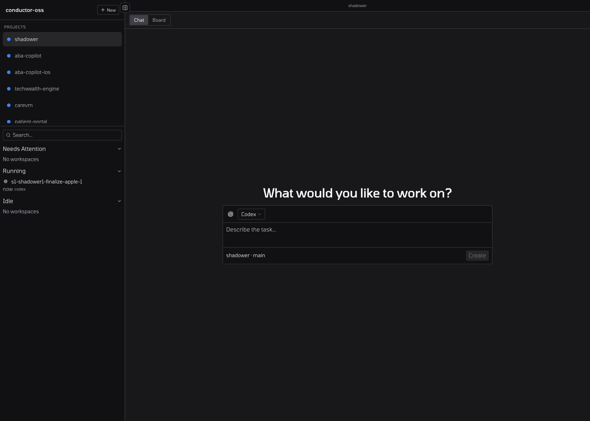
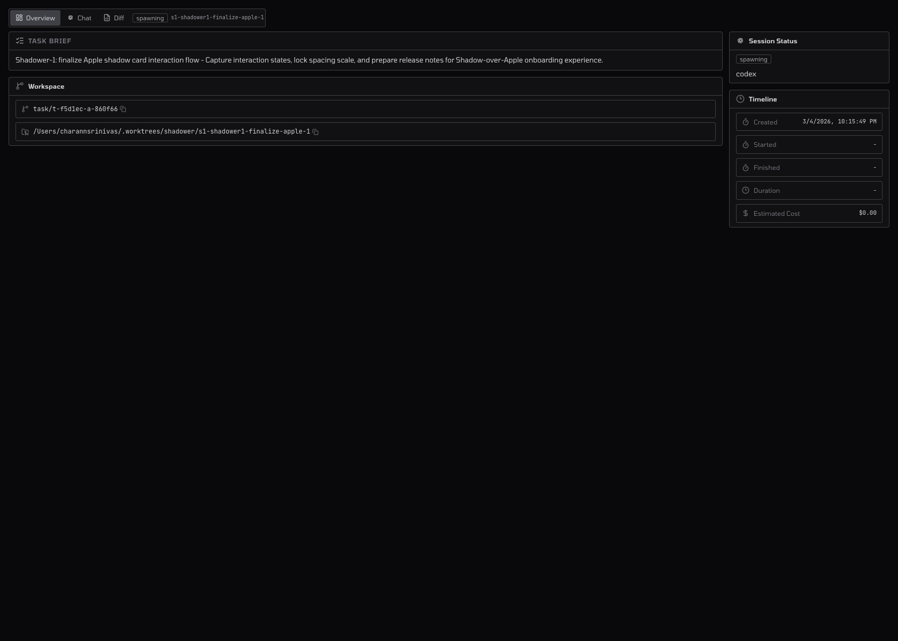
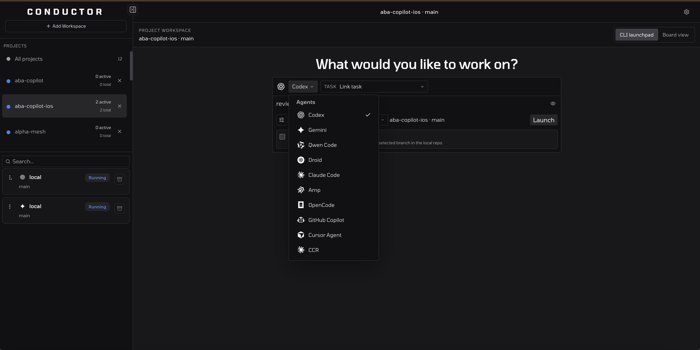
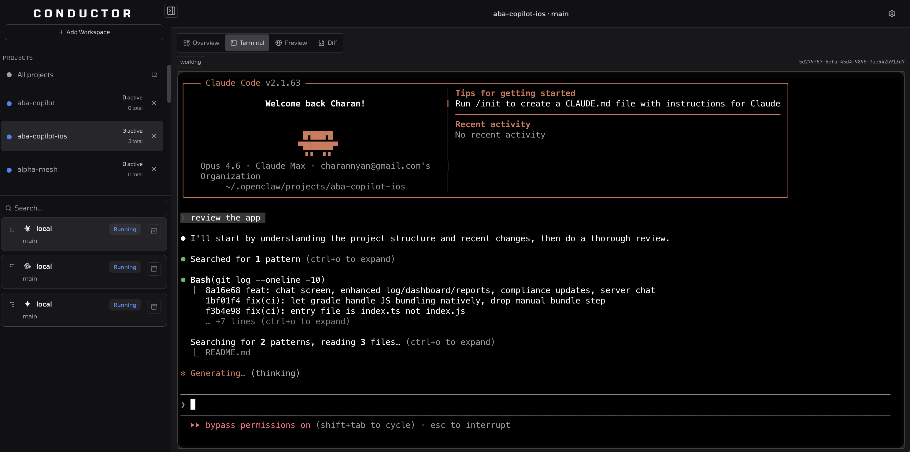
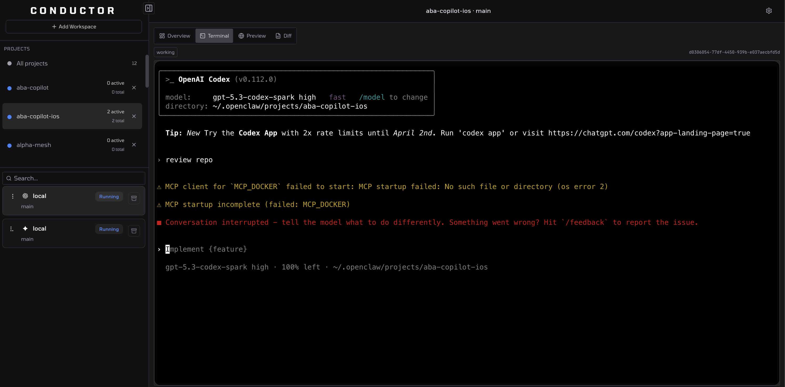
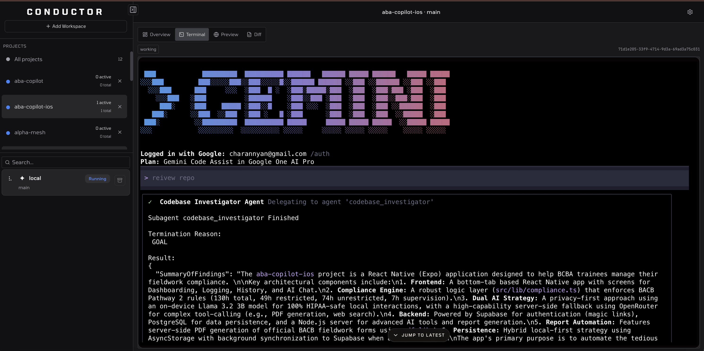

<div align="center">

# Conductor OSS

### Run real AI coding agents across your repos, from one dashboard

**Real terminals. Git worktrees. Local-first control.**

[](https://www.npmjs.com/package/conductor-oss)
[](https://github.com/charannyk06/conductor-oss/actions/workflows/ci.yml)
[](LICENSE)
[](https://www.rust-lang.org)
[](https://github.com/charannyk06/conductor-oss/stargazers)

</div>

---

Conductor OSS is a local-first orchestration layer for AI coding agents.

It helps you:
- connect a repo or local folder as a workspace
- launch Claude Code, Codex, Gemini, and other coding CLIs in isolated git worktrees
- watch the agent inside a real terminal, not a fake chat shell
- review diffs, previews, retries, restores, and reviewer feedback from one dashboard
- keep project state in normal local files like `conductor.yaml`, `CONDUCTOR.md`, and `.conductor/conductor.db`

## Read this first, there are two ways to use Conductor

A lot of confusion comes from mixing the local app and the hosted bridge flow.

### 1. Local dashboard on the same machine
Use this when Conductor and your repos live on the same laptop or desktop.

```bash
npx --yes --registry=https://registry.npmjs.org conductor-oss@latest
```

That defaults to `co start --open`.

If you do **not** pass a workspace, the launcher boots a default workspace at:

```text
~/.openclaw/workspace
```

### 2. Hosted dashboard plus paired device bridge
Use this when you want to open Conductor from another browser, another computer, or your phone while the actual work still runs on your own machine.

```bash
curl -fsSL https://app.conductross.com/bridge/install.sh | sh -s -- --connect --dashboard-url https://app.conductross.com --relay-url https://relay.conductross.com/
```

On Windows PowerShell:

```powershell
& ([scriptblock]::Create((Invoke-RestMethod -Uri 'https://app.conductross.com/bridge/install.ps1'))) -Connect -DashboardUrl 'https://app.conductross.com' -RelayUrl 'https://relay.conductross.com/'
```

The hosted dashboard is **not** a cloud IDE. Your repos, terminals, and agents stay on the paired machine.

## What Conductor actually is

Conductor sits between your repos and the coding CLIs you already use.

It is:
- a dashboard for linked workspaces and running sessions
- a launcher for supported coding agent CLIs
- a git worktree manager so concurrent sessions do not stomp on each other
- a session runtime with real ttyd-backed PTYs
- a local state layer backed by SQLite
- an optional paired-device bridge for remote access to your own machine

It is **not**:
- a replacement model provider
- a hosted cloud IDE that stores your code by default
- a fake browser chat wrapper around terminal output
- dependent on one agent vendor

## The main user flow

This is the flow the current app is built around.

1. Open Conductor.
2. Add a workspace.
3. Choose either:
   - a GitHub repository you already have access to, or
   - a local folder that already exists on disk
4. Conductor links that workspace and scaffolds local state as needed.
5. Start or resume agent sessions for that workspace.
6. Monitor the live terminal, inspect diffs, open previews, send feedback, retry, restore, or clean up.
7. If you like planning in Markdown, keep tasks in `CONDUCTOR.md`. If you prefer direct launches, use the dashboard or `co spawn`.

## Quick start

### Option A, point Conductor at an existing repo

```bash
cd /path/to/repo
npx --yes --registry=https://registry.npmjs.org conductor-oss@latest init
npx --yes --registry=https://registry.npmjs.org conductor-oss@latest start --workspace . --open
```

What this does:
- scaffolds `conductor.yaml`
- scaffolds `CONDUCTOR.md`
- starts the dashboard and Rust backend for that repo

### Option B, install globally

```bash
npm install -g conductor-oss
co start --open
```

Installed aliases:
- `conductor-oss`
- `conductor`
- `co`

### Option C, guided setup

```bash
co setup
```

Use this if you want a more guided first-run flow.

## What you will see in the app

### Workspace entry
The dashboard starts with a workspace-first flow. You link repos first, then manage sessions from there.

### Session detail
Each session page is built around four core surfaces:
- **Terminal**, the live interactive PTY session
- **Overview**, normalized state, metadata, and recovery actions
- **Preview**, project dev server URLs when available
- **Diff**, file changes and workspace inspection

<div align="center">

| Dashboard Overview | Session Detail |
|:---:|:---:|
|  |  |

</div>

### Native terminal experience
Agents run in their real terminal UI.

- Claude Code runs as Claude Code
- Codex runs as Codex
- Gemini runs as Gemini

Conductor uses the native PTY pipeline so reconnects, resize events, restore, and mobile terminal behavior act like a real terminal session.

<div align="center">

| Agent Picker | Claude Code Session |
|:---:|:---:|
|  |  |

| Codex Session | Gemini Session |
|:---:|:---:|
|  |  |

</div>

## Markdown board support

`CONDUCTOR.md` is still a first-class part of the product.

The default scaffold gives you a simple task lifecycle:

```text
Inbox -> Ready to Dispatch -> Dispatching -> In Progress -> Review -> Done
```

Use the board when you want Markdown-native planning that still maps cleanly onto session history and dispatch context.

If you want to skip the board for a quick run, you can still launch sessions directly with the CLI.

## CLI commands most users need

| Command | What it does |
|---------|---------------|
| `co start` | Start the dashboard and Rust backend |
| `co init` | Scaffold `conductor.yaml` and `CONDUCTOR.md` in a repo |
| `co setup` | Guided first-run setup |
| `co spawn <project> [prompt]` | Start a new agent session for a project |
| `co list` | List sessions |
| `co status` | Show the current attention-oriented session view |
| `co send <session> <message...>` | Send a message to a running session |
| `co feedback <sessionId> <message...>` | Send reviewer feedback and requeue the session |
| `co retry <sessionOrTask>` | Start a new attempt from an existing task or session |
| `co restore <session>` | Restore an exited session |
| `co kill <session>` | Kill a session |
| `co cleanup` | Reclaim resources from completed sessions |
| `co doctor` | Check backend and runtime health |
| `co dashboard` | Open the dashboard in a browser |
| `co bridge setup` | Install and pair Conductor Bridge for remote access |
| `co mcp-server` | Run Conductor as an MCP server over stdio |
| `co acp-server` | Run Conductor as an ACP server over stdio |

## Supported agents

Conductor ships adapters for the coding CLIs it can discover and launch today.

| Agent | CLI |
|-------|-----|
| Claude Code | `claude` |
| Codex | `codex` |
| Gemini | `gemini` |
| Qwen Code | `qwen` |
| Amp | `amp` |
| Hermes | `hermes` |
| Cursor CLI | `cursor-agent` |
| OpenCode | `opencode` |
| Droid | `droid` |
| GitHub Copilot | `gh copilot` or `copilot` |
| CCR | `ccr` |

The dashboard only offers agents it can discover on your machine.

## Local files Conductor creates

| File or directory | Purpose |
|-------------------|---------|
| `conductor.yaml` | Workspace config, project metadata, defaults, and server settings |
| `CONDUCTOR.md` | Markdown board for planning and dispatch |
| `.conductor/conductor.db` | SQLite runtime state for sessions, attempts, metadata, and coordination |
| `.conductor/rust-backend/detached/` | Detached PTY state for restore flows |
| `attachments/` | Uploaded files and generated session artifacts |
| `~/.conductor/` | Launcher runtime state and optional bridge state |

## Ports

### Launcher defaults
When you run `co start` from the published package:

- dashboard: `http://127.0.0.1:4747`
- Rust backend: `http://127.0.0.1:4748`

### Source checkout defaults
When you run the repo in development mode:

- dashboard: `http://127.0.0.1:3000`
- Rust backend: `http://127.0.0.1:4749`

## Access control, sign-in, and bridge

Conductor is local-first, but the codebase already includes hosted and paired-device paths.

Current pieces in the repo:
- verified Cloudflare Access JWT validation and role bindings
- optional Clerk-backed sign-in flows in the web app
- bridge and relay components for paired-device terminals and remote access

If you run the dashboard outside `co start`, set `CONDUCTOR_BACKEND_URL` or `NEXT_PUBLIC_CONDUCTOR_BACKEND_URL` so the web app can reach the Rust backend.

If that backend is reachable off-host and dashboard auth is enabled, also set the same `CONDUCTOR_PROXY_AUTH_SECRET` in both processes so forwarded dashboard auth headers can be verified safely.

Relay deployment is separate from dashboard deployment. See `docs/relay-deployment.md` if you are rolling out the paired-device stack.

## Develop from source

### Prerequisites
- Rust stable toolchain
- Bun `>= 1.2`
- Node.js `>= 18`
- `git`

### Install

```bash
bun install
```

### Run

```bash
bun run dev:full
```

Useful scripts:

```bash
bun run dev          # dashboard only
bun run dev:backend  # backend only through the launcher path
bun run build        # production build
bun run typecheck    # TypeScript type checking
cargo test --workspace
cargo clippy --workspace -- -D warnings
```

Optional development ports:

```bash
export CONDUCTOR_DEV_DASHBOARD_PORT=3000
export CONDUCTOR_DEV_BACKEND_PORT=4749
```

## Project structure

```text
conductor-oss/
├── bridge-cmd/               # Companion bridge binary used by the pairing flow
├── crates/
│   ├── conductor-cli/        # Native Rust CLI
│   ├── conductor-core/       # Config, board parsing, task and session models, scaffolding
│   ├── conductor-db/         # SQLite persistence
│   ├── conductor-executors/  # Agent adapters and process management
│   ├── conductor-git/        # Git and worktree operations
│   ├── conductor-relay/      # Relay server for bridge and remote terminal flows
│   ├── conductor-server/     # Axum server, routes, runtime state, SSE
│   ├── conductor-types/      # Shared transport and bridge protocol types
│   ├── conductor-watcher/    # Filesystem watching
│   └── notify-rust/          # Desktop notification support
├── packages/
│   ├── cli/                  # npm launcher
│   ├── core/                 # Shared TypeScript types and schemas
│   └── web/                  # Next.js dashboard
├── docs/
│   ├── screenshots/          # Product screenshots
│   └── *.md                  # Deployment notes, QA docs, and product docs
├── Cargo.toml                # Rust workspace
├── package.json              # Bun workspace
├── conductor.yaml            # User-created workspace config
└── CONDUCTOR.md              # User-created board file
```

## Known constraints

- Output quality depends on the upstream agent CLI you install. Conductor orchestrates sessions, it does not change the underlying model quality.
- GitHub-heavy flows work best with `gh` installed and authenticated.
- Preview tooling depends on a project exposing a local dev server or explicit preview URL.
- Public share-link remote control without an identity layer is not supported.
- Legacy tmux and old direct-session data should be archived, not treated as the preferred runtime path.

## Links

- GitHub: <https://github.com/charannyk06/conductor-oss>
- npm: <https://www.npmjs.com/package/conductor-oss>
- Issues: <https://github.com/charannyk06/conductor-oss/issues>
- Pull requests: <https://github.com/charannyk06/conductor-oss/pulls>

## Star History

[](https://star-history.com/#charannyk06/conductor-oss&Date)

## License

MIT. See [LICENSE](LICENSE).
