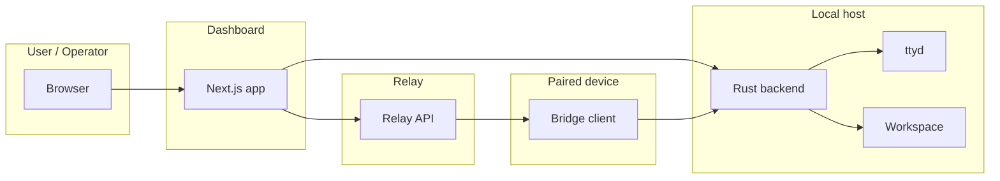

# Conductor OSS Threat Model

## Executive summary
Conductor OSS has solid default boundaries in the current tree: the Rust backend refuses remote binding unless an unsafe flag is set, relay/dashboard auth is now JWT-scoped instead of header-trusted, and ttyd tokens are HMAC-scoped. The remaining risk is concentrated in the preview/browser and relay edge: a public relay claim endpoint can be spammed for availability impact, and the server-side preview browser can be driven to attacker-influenced URLs while sharing one browser context across sessions. That combination creates realistic DoS, SSRF, and cross-session leakage paths even though the direct auth-bypass issues from prior reviews appear closed.

## Scope and assumptions
- In scope: `crates/conductor-server/`, `crates/conductor-relay/`, `bridge-cmd/`, and the dashboard app under `packages/web/`.
- Out of scope: OS/kernel compromise, browser sandbox escapes, upstream IdP compromises, and infrastructure not represented in the repo.
- Assumption: the default deployment is local-first, but the relay may be published on a network interface and the dashboard may be used by more than one operator.
- Assumption: project config and session metadata are not fully trusted because they can come from repositories, agent output, or user-editable settings.
- Assumption: the dashboard preview browser is an operator tool, not a public endpoint, but operators can still be tricked into loading attacker-influenced URLs.

Open questions that would materially change risk ranking:
- Is the relay reachable from the public internet in production, or always behind a strict firewall?
- Are multiple users/operators expected to share one dashboard instance?
- Can untrusted repositories contribute `devServerUrl` / `previewUrl` values or otherwise influence preview discovery?

## System model
### Primary components
- Next.js dashboard in `packages/web/`: UI, auth, dashboard API proxy, preview browser orchestration, and bridge JWT minting.
- Rust backend in `crates/conductor-server/`: session state, task/workspace control plane, filesystem browsing, attachments, GitHub webhook handling, and ttyd management.
- Relay in `crates/conductor-relay/`: device pairing, relay websocket fan-out, browser/device proxying, and relay-scoped JWT authorization.
- Bridge client in `bridge-cmd/`: paired-device agent that connects the local ttyd, local backend, and relay.
- Local ttyd process: interactive shell surface launched on loopback only.

### Data flows and trust boundaries
- Browser -> Next.js dashboard: session rendering, operator actions, preview commands, upload requests, and auth cookies/headers. Security guarantees come from Clerk/trusted-header auth, origin/fetch-metadata checks for actions, and route-level role checks.
- Next.js dashboard -> Rust backend (`127.0.0.1` by default): proxied API requests, session control, filesystem browsing, attachments, and terminal tokens. Security depends on loopback-only binding, header stripping in the proxy, and backend middleware that trusts only proxy-injected identity.
- Next.js dashboard -> Relay: relay JWTs and short-lived browser/terminal scopes. Security depends on HS256 JWTs with issuer/audience/scope validation and a required `RELAY_JWT_SECRET`.
- Relay -> paired device bridge client: websocket messages for terminal, API proxy, preview proxy, and bridge status. The bridge uses device refresh tokens, while browser-facing routes rely on relay-scoped JWTs or refresh tokens.
- Bridge client -> local ttyd / local backend / local preview server: loopback-only network access from the paired device host. This is intentionally powerful and should be treated as a privileged local boundary.
- Rust backend -> workspace filesystem: attachments, workspace browsing, and dev-server logs. Security depends on path normalization, allowlisted roots, and workspace scoping.
- Rust backend -> GitHub: webhook ingestion and GitHub API interactions. Security depends on HMAC webhook verification and GitHub auth tokens configured outside the repo.

#### Diagram

## Assets and security objectives
| Asset | Why it matters | Security objective (C/I/A) |
|---|---|---|
| Dashboard auth session and role state | Gates viewer/operator/admin actions and access to private sessions | C/I |
| Relay JWTs and device refresh tokens | Control bridge devices, terminal sessions, and device proxies | C/I |
| Terminal tokens | Grant live shell access through ttyd | C/I |
| Workspace files, attachments, and board state | Contain task output, prompts, code, and potentially secrets | C/I |
| Preview browser state (cookies, localStorage, cache) | Can leak or poison credentials across session previews | C/I |
| Relay pairing codes and pending claims | Control device onboarding and pairing flow | C/I/A |
| GitHub webhook secret / GitHub API credentials | Authorize inbound sync and outbound repo operations | C/I |
| Local machine resources reachable from the preview browser | Can be used as an SSRF target or exfiltration pivot | C/I/A |

## Attacker model
### Capabilities
- Remote internet attacker can reach the relay if it is published on `0.0.0.0:8080`.
- Malicious or compromised operator can use viewer/operator routes, preview commands, and terminal flows.
- Malicious repository, project config, or session output can influence preview discovery and candidate URLs.
- Same-host malware or another local process may be able to observe local services if they are exposed on loopback.

### Non-capabilities
- No assumed backend code execution or filesystem write outside the workspace unless a separate vulnerability exists.
- No assumed access to relay or dashboard secrets unless they are leaked or the attacker is already authenticated.
- No assumed ability to bypass the backend's loopback-only default without the explicit unsafe binding flag.

## Entry points and attack surfaces
| Surface | How reached | Trust boundary | Notes | Evidence (repo path / symbol) |
|---|---|---|---|---|
| Dashboard API routes | Browser requests to `/api/sessions/*`, `/api/attachments`, `/api/filesystem/*`, `/api/github/webhook` | Browser -> dashboard -> backend | Authenticated, but high-value operator surface | `packages/web/src/app/api/sessions/[id]/preview/route.ts`, `crates/conductor-server/src/routes/*` |
| Preview browser commands | Operator clicks or auto-connect loads preview URLs | Operator -> server-side browser | Can navigate to remote or local HTTP(S) URLs | `packages/web/src/components/sessions/SessionPreview.tsx:376-401`, `packages/web/src/lib/devPreviewBrowser.ts:162-206` |
| Relay public API | Internet-facing relay routes on `0.0.0.0:8080` | Internet -> relay | JWT-protected for dashboard APIs, but some onboarding endpoints are public | `crates/conductor-relay/src/relay.rs:342-379`, `:474-520` |
| Device pairing claim endpoints | Unauthenticated POST to `/api/devices/claims` | Internet -> relay | No auth and no visible request throttling | `crates/conductor-relay/src/relay.rs:474-482`, `:1714-1743` |
| Bridge websocket and browser websocket | Relay websocket upgrade with tokens in headers/query | Dashboard/bridge -> relay | Scoped JWTs and refresh tokens are the intended auth boundary | `crates/conductor-relay/src/relay.rs:806-903`, `packages/web/src/lib/bridgeRelayAuth.ts:53-99` |
| ttyd token route | Dashboard request for session ttyd tokens | Browser -> dashboard -> backend | Operator-gated and HMAC-scoped | `packages/web/src/app/api/sessions/[id]/terminal/ttyd/token/route.ts`, `crates/conductor-server/src/routes/terminal.rs:1183-1206` |
| Filesystem browser | Operator browses workspace and allowed roots | Browser -> backend filesystem | Exposes directory metadata beyond the workspace | `crates/conductor-server/src/routes/filesystem.rs` |
| GitHub webhook | GitHub POSTs webhook payloads | GitHub -> backend | HMAC signature is required | `crates/conductor-server/src/routes/github.rs:671-699` |

## Top abuse paths
1. Remote attacker floods the public relay claim endpoint -> `POST /api/devices/claims` repeatedly -> pending claim queue fills to the 1024 cap -> legitimate device onboarding fails until entries expire.
2. Malicious project config or launch metadata supplies a remote `previewUrl`/`devServerUrl` -> the preview browser auto-connects to `candidateUrls[0]` -> the dashboard server fetches attacker-controlled content and can pivot into local/internal HTTP targets.
3. A previewed origin sets cookies/localStorage in one session -> another session reuses the same Puppeteer browser context -> state leaks or is poisoned across unrelated previews.
4. A `terminal-browser` relay JWT appears in logs, browser history, or proxy telemetry -> attacker replays the short-lived token within the 5-minute TTL -> live terminal access is hijacked.
5. A compromised operator account uses the authenticated filesystem and attachment surfaces -> workspace files, allowed-root metadata, and uploaded content are enumerated or modified -> task data and secrets in the workspace become exposed.

## Threat model table
| Threat ID | Threat source | Prerequisites | Threat action | Impact | Impacted assets | Existing controls (evidence) | Gaps | Recommended mitigations | Detection ideas | Likelihood | Impact severity | Priority |
|---|---|---|---|---|---|---|---|---|---|---|---|---|
| TM-001 | Remote internet attacker | Relay reachable; no upstream request throttling | Spam `POST /api/devices/claims` to fill pending claim state | Blocks device onboarding and increases relay memory use | Device claims, onboarding flow, relay availability | Queue cap of 1024 and 10 minute TTL (`crates/conductor-relay/src/relay.rs:1714-1743`) | No auth, no rate limit, no origin restriction on the claim endpoint | Add per-IP and per-subnet throttles, consider proof-of-work or authenticated claim creation, and export queue-depth metrics | Alert on claim creation rate, queue depth, and sustained 4xx/5xx spikes | High | Medium | Medium |
| TM-002 | Malicious repo/config or compromised operator | Session/project config can set `previewUrl` / `devServerUrl` | Auto-connect the server-side browser to attacker-chosen HTTP(S) origin and allow unrestricted direct navigation | SSRF into internal services, data exfiltration, and remote content execution from the dashboard host | Local network resources, preview browser state, operator trust | Only http/https are allowed; bridge mode restricts to loopback allowed origins (`packages/web/src/lib/devPreviewBrowser.ts:162-206`, `packages/web/src/lib/previewSession.ts:294-352`) | Remote origins are explicitly allowed for `previewUrl` / `devServerUrl`, and direct mode disables request interception (`packages/web/src/lib/previewSession.ts:301-307`, `packages/web/src/lib/devPreviewBrowser.ts:166-179`, `:381-431`) | Require explicit operator confirmation for non-loopback origins, split remote vs local preview modes, and optionally enforce an origin allowlist from config | Log candidate origin, auto-connect decision, and every remote navigation; alert on non-loopback targets | Medium | High | High |
| TM-003 | Malicious or compromised preview session | Two sessions share the same browser process | Plant cookies/localStorage or other origin state in one session and read/poison it in another | Cross-session confidentiality/integrity loss | Preview browser state, session cookies, localStorage, auth state | Separate page objects per session (`packages/web/src/lib/devPreviewBrowser.ts:534-553`) | Uses `browser.newPage()` on one shared browser instance, not an isolated browser context (`packages/web/src/lib/devPreviewBrowser.ts:299-314`, `:534-553`) | Create a browser context per session, destroy it on cleanup, and clear storage between navigations when feasible | Track context/session IDs and alert on repeated same-origin state across sessions | Medium | High | High |
| TM-004 | Log observer, proxy, or anyone who can capture returned WebSocket URLs | Access to logs, browser history, or telemetry that records query strings | Replay `terminal-browser` JWT from the websocket URL before expiry | Live terminal session hijack | Terminal session, shell output, operator trust | JWTs are issuer/audience/scope bound and expire in 5 minutes (`packages/web/src/lib/bridgeRelayAuth.ts:53-99`, `crates/conductor-relay/src/relay.rs:2635-2660`) | Token is transported in a URL query parameter, which is commonly logged | Move to a one-time token exchange or header-based auth on same-origin fetch before websocket upgrade; scrub query strings from logs | Alert on unexpected terminal websocket opens from new IPs or repeated token replays | Medium | Medium | Medium |

## Criticality calibration
- Critical: pre-auth remote code execution, relay/dashboard auth bypass, or arbitrary workspace escape that exposes shell or secret material. Example: a forgeable relay identity header that grants control of another user's device; a backend auth bypass that opens the Rust API remotely.
- High: server-side browser pivot into internal services, cross-session secret leakage, or authenticated paths that can reach shell/control-plane functions. Example: preview auto-connect to attacker-controlled origin; browser context reuse that leaks cookies between sessions.
- Medium: remote or authenticated denial of service, token replay windows, or limited data exposure that requires operator-level access. Example: filling the public claim queue; replaying a short-lived terminal JWT from logs.
- Low: informational leaks or nuisance failures that require already-privileged access and do not widen the trust boundary. Example: a `/health` counter leak or a benign preview warning message.

## Focus paths for security review
| Path | Why it matters | Related Threat IDs |
|---|---|---|
| `crates/conductor-relay/src/relay.rs` | Public relay API, websocket auth, device claims, and terminal proxying all live here | TM-001, TM-004 |
| `packages/web/src/lib/previewSession.ts` | Derives preview candidates from session/project metadata and decides what the browser opens | TM-002 |
| `packages/web/src/lib/devPreviewBrowser.ts` | Implements browser navigation, request interception, and shared browser lifecycle | TM-002, TM-003 |
| `packages/web/src/components/sessions/SessionPreview.tsx` | Auto-connects to the first candidate URL and exposes operator preview controls | TM-002, TM-003 |
| `packages/web/src/lib/auth.ts` | Dashboard auth, role checks, loopback handling, and CSRF-style action guards | General auth boundaries |
| `packages/web/src/lib/bridgeRelayAuth.ts` | Mints relay JWTs and decides what identity is sent to the relay | TM-004 |
| `packages/web/src/lib/bridgeApiProxy.ts` | Proxies dashboard traffic to the relay and strips/adds auth headers | TM-002, TM-004 |
| `packages/web/src/lib/rustBackendProxy.ts` | Enforces which headers reach the Rust backend | General trust boundary |
| `crates/conductor-server/src/routes/middleware.rs` | Backend route auth and rate limiting are enforced here | General auth boundaries |
| `crates/conductor-server/src/routes/terminal.rs` | Terminal token issuance and HMAC verification live here | TM-004 |
| `crates/conductor-server/src/routes/filesystem.rs` | Broad filesystem browsing surface; review path normalization and allowed roots | Operator data exposure |
| `crates/conductor-server/src/routes/github.rs` | Webhook signature verification and GitHub sync path | Inbound webhook trust |

## Notes on use
- The current tree does not show the old forwarded-host or relay-header auth bypasses from prior reports; those controls appear to have been replaced with JWT-scoped relay auth and loopback-only backend defaults.
- The main residual risk is not a single auth bypass, but the combination of a public relay onboarding surface and a powerful operator preview browser that can be pointed at attacker-controlled origins.

## Quality check
- [x] Discovered entry points are covered: dashboard routes, relay routes, preview browser, ttyd, filesystem, attachments, and GitHub webhook.
- [x] Each major trust boundary appears in the threat table: browser/dashboard, dashboard/backend, dashboard/relay, relay/device, and browser/session state.
- [x] Runtime behavior is separated from dev/build behavior: the review focuses on live routes and browser flows, not tests or CI.
- [x] Assumptions and open questions are explicit in the scope section.
- [x] Existing mitigations are distinguished from residual gaps and recommended follow-ups.
